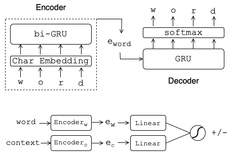

# Word2Vec


This repo contains python implementation of word2vec models (skiagram and continuous bag-of-words) and character-based variants of skigram. The latter were used in the following paper

<a href='https://arxiv.org/pdf/2311.09319'></a> 

```
@inproceedings{spokenW2V,
  author={Mohammad Amaan Sayeed and Hanan Aldarmaki},
  title={{Spoken Word2Vec: Learning Skipgram Embeddings from Speech}},
  year=2024,
  booktitle={Proc. INTERSPEECH 2024}
}
```

The scripts to train models using audio features instead of character sequences are [available here](https://github.com/rainmaker29/SpokenWord2Vec). 

## Word-Based Models

The following word embedding models are available:

### Skipgram

Skipgram with negative sampling is implemented in the file ``` train_sgns_original.py ```

### Continuous bag-of-words

Continuous bag of words model is implemented in the file ``` train_cbow_original.py ```

Note that while the above models work properly, but may not give optimal results compared to [gensim](https://pypi.org/project/gensim/) implementation. 

## Character-Based Models



Here we have variants of skipgram with negative sampling (SGNS) but with each word broken into a sequence of characters. This is implemented in two ways:

### Two-Stage model

In this model, character sequences are first embedded into fixed-length vectors using a character auto-encoder. The resulting fixed-length vector is used as input to SGNS algorithm. The implementation is in ```sgns_B.py```. Note that the scale of the model (depth and width) can be changed by setting the ```s``` parameter between to a value between 1 and 4 (see paper for additional details)

### End-to-end model

This model encodes character sequences into a fixed-length vector that is fed directly to SGNS and trained end-to-end. The implementation is in ```sgns_C.py```. Note that the scale of the model (depth and width) can be changed by setting the ```s``` parameter between to a value between 1 and 4 (see paper for additional details)

## Evaluation

To evaluate the resulting embeddings, we compare with gensim embeddings. We provide the evaluation script in ```eval_embeddings.py```. The training scripts also contain the same evaluation steps. 
